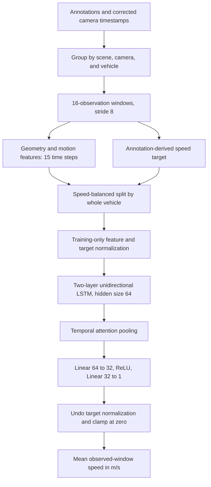

# Geometry-only vehicle speed estimation: architecture and implementation

This document describes the implemented **v2 feature pipeline with the speed-balanced vehicle split**. The system estimates a vehicle's average speed over an observed sequence from numerical bounding boxes and timestamps. It does not read images or learn visual appearance. Three independently trained models use 2D geometry, 3D geometry, or both.

## 1. End-to-end architecture



The combined model concatenates 2D and 3D features before the LSTM. It does not use two separate encoders or average the outputs of the other models.

| Model | Input tensor | Trainable parameters |
|---|---|---:|
| 2D | batch × 15 × 53 | 65,922 |
| 3D | batch × 15 × 41 | 62,850 |
| Combined | batch × 15 × 93 | 76,162 |

Sixteen observations yield fifteen transitions because motion features require a previous observation. The window represents approximately 0.5 seconds at 30 frames/s, but calculations use actual timestamps rather than assuming a fixed frame rate.

## 2. Data preparation and coordinate conventions

The adapter reads `data/obj/scene*_annotations.csv`, `data/ts/scene*_ts.csv`, and `data/hg/scene*_hg.json`. The timestamp files provide corrected times for each camera and frame.

Within each scene, observations are grouped by camera and vehicle ID, sorted by frame, and deduplicated by frame. Windows use 16 consecutive frame indices with a stride of 8. A window is rejected for invalid geometry, nonfinite values, nonincreasing timestamps, missing frame indices, or a timestamp gap greater than 0.2 seconds. Windows cannot cross vehicle or camera boundaries. Timestamp arithmetic uses float64 to preserve small differences between large Unix timestamps; model features use float32.

The adapter interprets the annotated x/y location as the rear ground-center of the vehicle and assumes a flat road at z = 0. With direction d in {-1, +1}, its metric box center is:

```text
center_x = (x + d × length / 2) × 0.3048
center_y = y × 0.3048
center_z = height / 2 × 0.3048
metric dimensions = [length, width, height] × 0.3048
```

These are the coordinate assumptions implemented in the adapter. Vertical position is inferred from height, not independently measured.

For 2D inputs, the eight annotated cuboid corners are projected through the supplied directional camera projection matrix. Dividing projected homogeneous coordinates by their third coordinate gives image-plane points. Their coordinate-wise minimum and maximum produce an axis-aligned xyxy box. These idealized boxes are not detector outputs and are not clipped to image boundaries. If projection crosses the horizon, the current adapter skips that camera/vehicle group for modes requiring 2D geometry.

## 3. Feature engineering and its rationale

### 3.1 Static geometry

For a 2D box `(xmin, ymin, xmax, ymax)`:

```text
center = [(xmin + xmax)/2, (ymin + ymax)/2]
bottom_center = [(xmin + xmax)/2, ymax]
width = xmax - xmin
height = ymax - ymin
area = width × height
aspect_ratio = width / height
```

The center summarizes image-plane position. The bottom-center is an approximate ground-contact point that can behave differently from the box center when height changes. It is not guaranteed to be the projection of the true vehicle ground-center. Absolute image position and apparent size also provide perspective context: the same pixel displacement can correspond to different physical distances in different parts of the image.

The 3D geometry vector contains metric center x/y/z, length, width, height, and volume. It provides physical position and dimensions directly.

### 3.2 Changes over time

For any raw geometry component g and elapsed time Δt:

```text
rate_i = (g_i - g_(i-1)) / (t_i - t_(i-1))
```

Signed changes preserve motion direction. A car's center movement indicates translation, while width, height, area, and volume changes describe changes in apparent size or box estimates. In this dataset, physical dimensions are often constant, so their usefulness is limited.

Relative position is measured from the first observation in each window:

```text
relative_position_i = position_i - position_0
```

This allows the network to use movement relative to the starting point alongside absolute location, reducing its need to infer displacement from large absolute coordinates.

For each 2D center, 2D bottom-center, and 3D center, velocities are computed over lags k = 1, 3, 5, and 10:

```text
velocity_i,k = (position_i - position_(i-k)) / (t_i - t_(i-k))
```

Short intervals capture rapid changes; longer intervals average motion over more time and can reduce sensitivity to frame-to-frame jitter. Before k observations of history are available, that feature is zero and its validity mask is zero. Once available, the mask becomes one. This distinguishes missing history from genuine zero motion.

Relative size change uses logarithmic rates:

```text
log_size_rate_i = (log(size_i) - log(size_(i-1))) / Δt_i
```

These measure proportional rather than absolute growth. They are calculated for 2D width/height and 3D length/width/height.

Acceleration is the difference between consecutive one-step velocities divided by the distance between their interval midpoint times:

```text
acceleration_i = (velocity_i - velocity_(i-1)) / ((Δt_i + Δt_(i-1))/2)
```

Its first value is zero with an unavailable-history mask. Acceleration can identify changing motion but is also sensitive to annotation noise. All features at a time step use only current and earlier observations; no future observations are consulted.

### 3.3 Exact feature counts

| Feature block | 2D | 3D |
|---|---:|---:|
| Raw geometry | 8 | 7 |
| One-step rates of raw geometry | 8 | 7 |
| Logarithmic size rates | 2 | 3 |
| Relative positions | 4 | 3 |
| Four-lag velocity components | 16 | 12 |
| Lag-validity masks | 8 | 4 |
| Acceleration components | 4 | 3 |
| Acceleration-validity masks | 2 | 1 |
| Elapsed time | 1 | 1 |
| **Total** | **53** | **41** |

Combined mode uses 53 + 41 − 1 = **93** features because elapsed time is included once. Some components intentionally overlap: bottom-center x equals center x, and lag-1 velocity duplicates the corresponding raw-position rate. The current version prioritizes explicit feature construction over a minimal feature set; it is not a feature-selection study.

## 4. What the model learns to predict

The target is mean planar path speed over the same observed window:

```text
target = sum(norm([x_i, y_i] - [x_(i-1), y_(i-1)])) / (t_last - t_first)
```

Positions are in metres and times in seconds, so the target is m/s. This is neither future speed forecasting nor instantaneous speed at the final frame. No observations beyond the input window are used to construct the target.

Targets are derived from annotations because independent radar/GPS labels are not available in this implementation. For 3D and combined modes, the positions used to construct the target are also model inputs. Consequently, the experiment largely tests whether the network can learn a geometric motion calculation. Excluding an explicit scalar speed feature does not remove that target dependence.

## 5. Speed-balanced splitting without vehicle overlap

The original scene split trained on fast traffic and tested mostly on slow traffic. The current protocol pools all three scenes and aims to assign about 70% of windows in each 5 m/s speed bin to training, 15% to validation, and 15% to testing.

The indivisible allocation unit is **(scene, vehicle ID)**. All cameras and all overlapping windows of that vehicle stay together. Splitting individual windows randomly would let nearly identical sequences from the same vehicle appear in both training and testing.

The algorithm constructs a speed histogram for every vehicle group, prioritizes groups containing rare speeds, and greedily assigns each group to the partition that produces the smallest increase in normalized squared deviation from target bin counts. Seed 42 controls tie-breaking. A safeguard ensures all three partitions receive a group. Exact ratios are not always possible because vehicles cannot be divided, especially for rare speeds.

Speed labels are used to stratify the partition, not passed to the neural network as inputs. Balancing matches the speed distribution across partitions; it does not make every speed bin equally frequent.

| Partition | Windows | Vehicle groups | Mean speed (m/s) |
|---|---:|---:|---:|
| Training | 68,281 | 498 | 17.462 |
| Validation | 14,669 | 110 | 17.554 |
| Test | 14,641 | 109 | 17.426 |

The saved manifest records group assignments. All three models were verified to use identical test windows and targets. This protocol evaluates new vehicles from familiar scenes. It does not establish performance on new scenes or cameras, and separate vehicles in the same traffic stream can still be correlated.

## 6. Neural network

### Recurrent encoder

A two-layer, unidirectional LSTM processes the normalized sequence. Each layer has 64 hidden units. Hidden and cell states start from zero on every window; state is not carried between windows. Dropout of 0.1 applies between LSTM layers during training.

The input shape is `[batch, 15, feature_count]`; the encoder output is `[batch, 15, 64]`. The LSTM's memory and gating mechanisms allow the network to combine observations across the window rather than estimating speed independently from one box. This is the intended rationale, not a demonstrated advantage over every simpler estimator.

### Temporal attention

Each hidden vector h_i receives a learned scalar score:

```text
score_i = wᵀ h_i + b
attention_i = softmax(score)_i
context = sum(attention_i × h_i)
```

The context shape is `[batch, 64]`. This lets the network learn how much each time step contributes to the window estimate. It is simple temporal attention, not Transformer multi-head attention. Attention weights should not be treated as verified explanations of physical causality.

### Regression head

```text
context [batch,64]
  → Linear(64,32)
  → ReLU
  → Linear(32,1)
  → standardized speed [batch]
```

The last layer is linear. Predicted speed is converted back to physical units and clamped to zero for evaluation and inference. The training loss uses the unclamped standardized prediction.

## 7. Normalization and training

Feature means and standard deviations are calculated over training windows and time steps only, with float64 accumulation. Each standard deviation is bounded below by 1e-6. These statistics normalize training, validation, test, and inference inputs, including the validity-mask features. Overlapping windows count repeatedly in these statistics.

Target speeds are standardized using training mean and standard deviation. Training minimizes mean squared error between standardized predictions and standardized targets.

| Setting | Implemented value |
|---|---|
| Optimizer | AdamW |
| Learning rate | 0.001 |
| Weight decay | PyTorch AdamW default, 0.01 |
| Batch size | 128 |
| Gradient clipping | Global norm capped at 1.0 |
| Epochs in reported runs | 10; CLI default is 20 |
| Seed | 42 |
| Checkpoint selection | Lowest validation RMSE in m/s |
| Scheduler / early stopping | Neither implemented |

Training batches are shuffled; evaluation batches are not. The selected checkpoint is evaluated on the test partition after training. Metrics are window-weighted: longer tracks and vehicles visible in more cameras contribute more samples. Results are from a single seed, without confidence intervals.

## 8. Inference and saved artifacts

A checkpoint stores network weights, input size, hidden size, feature version, observation count, maximum timestamp gap, normalization statistics, output units, seed, and split name. `Predictor` restores the model in evaluation mode and uses the saved feature version; older v1 checkpoints remain supported.

For each inference request, provide the configured number of observations, increasing timestamps in seconds, and the boxes required by that checkpoint's mode. 2D coordinates must match the training image-coordinate scale. 3D input is `[center_x, center_y, center_z, length, width, height]` in metres. No image tensor is accepted or needed.

```python
from speed_lstm.model import Predictor

predictor = Predictor('runs/v2_speed_balanced/3d/best.pt')
speed_mps = predictor.predict(timestamps, boxes3d=metric_boxes)
speed_kmh = speed_mps * 3.6
```

The caller must supply a single consistently tracked vehicle. The inference API validates numerical geometry and timestamps, but it cannot verify vehicle identity or consecutive frame indices because those identifiers are not part of its arguments.

## 9. Results and interpretation

| Model | Test MAE (m/s) | Test RMSE (m/s) |
|---|---:|---:|
| 2D | 0.623 | 0.895 |
| 3D | 0.153 | 0.228 |
| Combined | 0.215 | 0.355 |

The 3D model has the lowest error in this run. Combined inputs are not guaranteed to help: they add potentially redundant and perspective-dependent information. These results do not isolate why one model outperforms another.

Two baselines are saved: a constant training-mean speed and direct endpoint world displacement divided by elapsed time. The latter uses metric coordinates even in the 2D experiment and is therefore a physical reference rather than a fair 2D-only competitor. Its endpoint-distance formula differs from the path-length target when motion curves or annotations jitter.

The revised split improves speed coverage, but it also changes the test population and evaluation question. Its scores cannot be interpreted as a controlled improvement over the earlier scene-held-out scores. Projected annotation boxes, inferred z, target dependence on input positions, and retained annotation outliers limit the strength of real-world accuracy claims.

## 10. Code map and verification

| File | Responsibility |
|---|---|
| `speed_lstm/data.py` | Read annotations, convert coordinates, project boxes, construct windows and targets |
| `speed_lstm/features_v2.py` | Compute geometry, temporal changes, and validity masks |
| `speed_lstm/splitting.py` | Allocate whole vehicles while matching speed-bin proportions |
| `speed_lstm/model.py` | LSTM, attention, regression head, checkpoint-based inference |
| `speed_lstm/train.py` | Normalize, optimize, select checkpoint, evaluate, save artifacts |
| `speed_lstm/diagnostics.py` | Metrics, speed coverage, and errors by speed range |
| `speed_lstm/balanced_report.py` | Summarize balanced runs and validate consistent manifests |
| `speed_lstm/predict.py` | JSON-window inference CLI |

The 12 existing tests cover timestamp handling, motion and size rates, projection bounds, checkpoint loading, causal features, translation invariance of relative motion, diagnostics, reproducible splitting, approximate speed balance, and vehicle isolation. These verify implementation properties; they do not substitute for independent speed ground truth.

## Implementation notes (this build)

A few places in the prose above were ambiguous enough that they needed a concrete choice to implement. Documented here rather than left silent:

- **"16 observations yield fifteen transitions"** was taken literally: every feature (not just the motion ones) is emitted per *transition*, so a window's raw observation 0 only ever serves as history — it never appears as its own output row. This is what makes the acceleration mask "zero only at the first value" come out exactly right (it needs two prior one-step velocities, and this indexing gives exactly one invalid step, not two).
- **Horizon-crossing rejection** ("the current adapter skips that camera/vehicle group") is implemented as a per-*window* rejection, not a per-*group* one — one bad frame doesn't discard an otherwise-valid long track. See the comment in `data.py::build_windows`.
- **2D/3D/combined window population**: windowing always applies the 2D-projection filter, even when training a 3D-only model, specifically so the speed-balanced split (which only depends on the window population + seed) is *identical* across all three modes on the same data/scenes/seed — required for the "all three models were verified to use identical test windows" claim in section 5, and checked by `balanced_report.verify_consistent_test_sets`.
- **Splitting cost function**: the greedy assignment cost is a fill-ratio (`c * (current+c)/target`, summed over the group's bins), not a squared-deviation-normalized-by-target-size term. An earlier version normalized each partition's deviation by *its own* target, which made val/test (small targets) look artificially urgent long before train (a much larger target) did — rare-speed groups piled into val/test instead of train, produced roughly a 40/30/30 split instead of 70/15/15. The fill-ratio formulation is scale-invariant across partitions with very different target sizes and is covered by `tests/test_splitting.py::test_approximate_speed_balance`.

This build has not been run against a real I-24 `hg.json`/annotation export — only against synthetic fixtures shaped like the documented schema (see `tests/helpers.py`). The feature/model/training code is verified for internal consistency (shapes, causality, translation invariance, split balance, checkpoint round-tripping); numerical correctness of the camera projection against a *real* homography file, and end-to-end accuracy on real data, are unverified.
